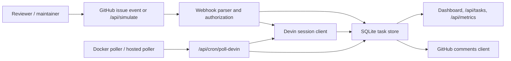
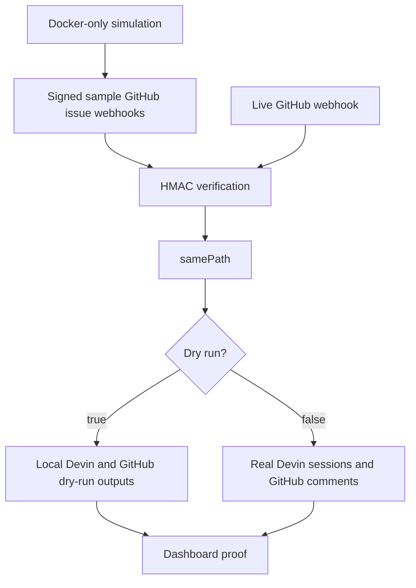
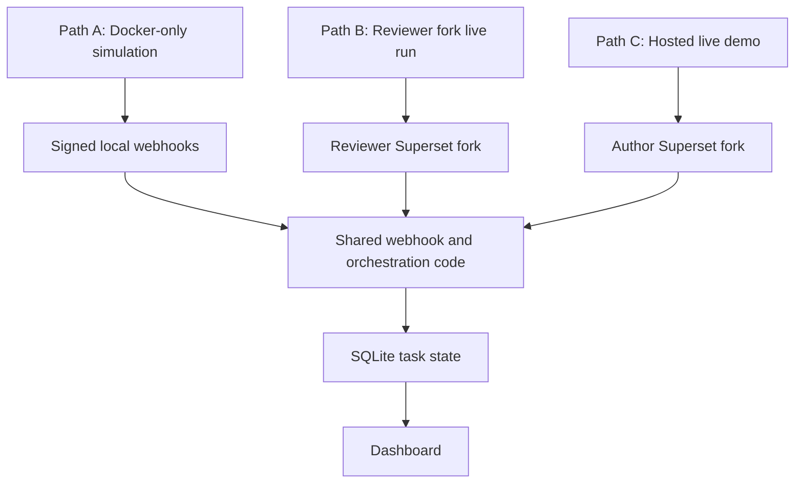
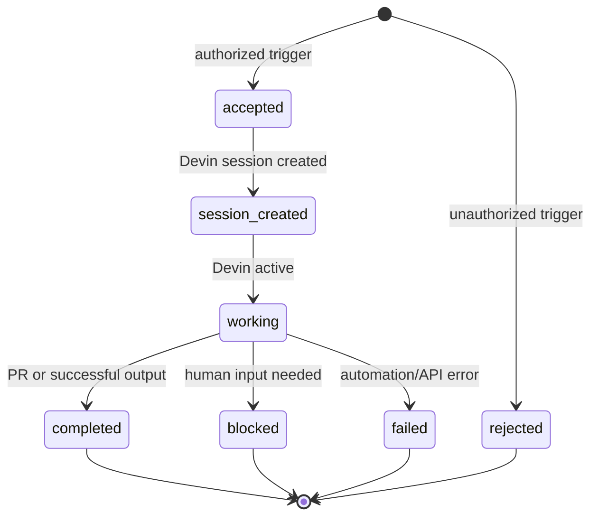

# Project Flow

## Architecture

## Runtime Modes

## Reproduction Paths

## Task Lifecycle

## Reproducibility Boundary

The solution repo is enough to reproduce the automation behavior locally with Docker. The Superset fork is evidence for the live engagement: selected issues, labels, PR links, and review flow. A reviewer who does not have write access to the author's fork can still run the Docker simulation end to end, then optionally point the same app at their own Superset fork by changing the GitHub environment variables and webhook URL. The hosted demo is intentionally scoped to the author's fork and should be treated as an observable live demo, not a multi-tenant reviewer sandbox.
